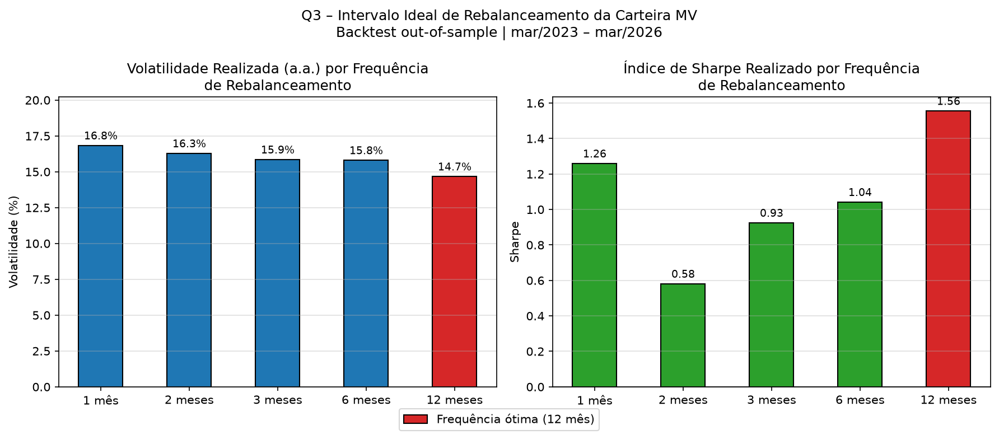

# Questão 3 – Intervalo Ideal de Rebalanceamento da Carteira de Mínima Variância

## Metodologia

A carteira de mínima variância é calculada a partir da covariância histórica dos ativos. Com o tempo, as correlações e volatilidades dos ativos mudam, fazendo com que os pesos estimados fiquem desatualizados. O rebalanceamento é o ato de recalcular esses pesos e ajustar a carteira — e a pergunta desta questão é: **com que frequência isso deve ser feito?**

Para responder, foi utilizado um **backtest out-of-sample por frequência fixa**, descrito a seguir.

---

## Lógica do Backtest

Foram testadas cinco frequências candidatas: **1, 2, 3, 6 e 12 meses**, usando os mesmos dados da Questão 2 (março/2023 a março/2026, 770 dias úteis).

Para cada frequência F, o procedimento foi:

1. **Estimação (in-sample):** usa-se os F meses imediatamente anteriores para estimar a covariância e calcular os pesos da carteira MV.
2. **Aplicação (out-of-sample):** os pesos estimados são *congelados* e aplicados nos F meses seguintes, sem qualquer ajuste. Os retornos diários realizados nesse período são coletados.
3. Esse processo se repete ao longo de todo o histórico, sempre usando dados passados para estimar e dados futuros para avaliar — **nunca olhando para o futuro**.

Ao final, os retornos diários out-of-sample de todas as janelas são concatenados e usam-se duas métricas para comparar as frequências:

- **Volatilidade anualizada realizada** — critério principal, pois o objetivo da carteira MV é minimizar risco.
- **Índice de Sharpe** — avalia a relação retorno/risco, usando a Selic (~10,75% a.a.) como taxa livre de risco.

---

## Resultados

| Frequência | Janelas OOS | Vol. realizada (a.a.) | Retorno (a.a.) | Sharpe |
|---|---|---|---|---|
| 1 mês | 36 | 16,84% | 31,96% | 1,26 |
| 2 meses | 17 | 16,29% | 20,22% | 0,58 |
| 3 meses | 11 | 15,86% | 25,42% | 0,93 |
| 6 meses | 5 | 15,81% | 27,23% | 1,04 |
| **12 meses** | **2** | **14,67%** | **33,58%** | **1,56** |

---

## Conclusão

O backtest indica que **rebalancear a cada 12 meses** é a frequência ótima para esta carteira no período analisado, produzindo a menor volatilidade realizada (14,67% a.a.) e o maior Índice de Sharpe (1,56).

Isso acontece porque rebalancear com muita frequência — por exemplo, todo mês — faz com que os pesos sejam recalculados com base em poucos dados, capturando ruído de curto prazo em vez de padrões estruturais de correlação entre os ativos. Com uma janela de estimação maior (12 meses), a covariância estimada é mais estável e os pesos resultantes são mais robustos, reduzindo a volatilidade efetiva da carteira no período seguinte.

**Limitação:** com apenas 37 meses de dados disponíveis, a frequência de 12 meses conta com somente 2 janelas out-of-sample, o que limita a confiança estatística da conclusão. Para resultados mais confiáveis, seria necessário um histórico mais longo (idealmente 10+ anos). Ainda assim, a tendência é consistente: a volatilidade realizada cai monotonicamente conforme a frequência de rebalanceamento diminui, o que reforça a conclusão.
